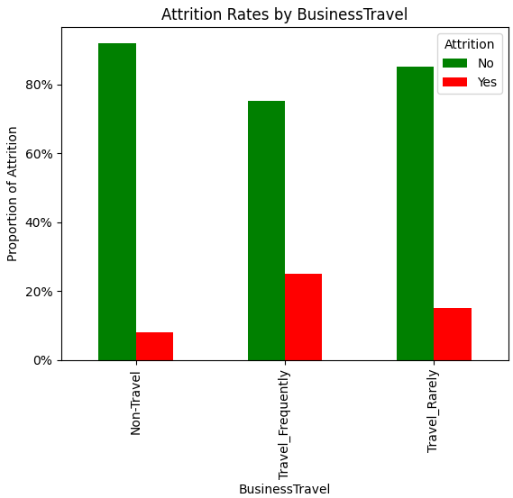

# Emp Attrition Prediction
A machine learning project to predict employee attrition based on various factors such as demographics, job satisfaction, and work compensation details. This model helps HR and management teams proactively identify at-risk employees and improve retention strategies.

## Table of Contents
- [Overview](#overview)
- [Project Structure](#project-structure)
- [Exploratory Data Analysis](#exploratory-data-analysis)
- [Modeling Approach](#modeling-approach)
- [Model Evaluation](#model-evaluation)
- [Future Work](#future-work)

## Overview
Employee attrition prediction is vital for reducing turnover-related costs and building a supportive work environment. This project utilizes machine learning to provide insights into employee attrition likelihood based on diverse features, empowering data-driven decisions in HR practices.

## Project Structure
- **Analysis.ipynb**: This notebook contains the exploratory data analysis (EDA) script, with data visualizations, statistical summaries, and feature engineering to gain a comprehensive understanding of the dataset before model development.
- **Model_Building.ipynb**: This notebook houses various model experimentation and evaluation steps. Different machine learning models are tested, fine-tuned, and validated to identify the optimal approach for predicting employee attrition.

## Exploratory Data Analysis
The dataset initially contained **1480 rows and 38 columns**. Detailed descriptive statistics and analysis were conducted on both numerical and categorical features to assess data quality and gather insights.

### Key EDA Findings:
- **Numerical Variables**: 
  - `Age`: Average employee age is 37 years, ranging from 18 to 60.
  - `YearsAtCompany`: Median tenure is 5 years, with some employees reaching 40 years at the company.
- **Categorical Variables**:
  - `BusinessTravel`: Categories include `Travel_Rarely`, `Travel_Frequently`, and `Non-Travel`. `Travel_Rarely` is the most common.
  - `Attrition`: Target variable, with 16% of employees having left the company, leading to a class imbalance.
  - `Over18` Binary Varaible, Contained 100% `Yes` answer, on the other hand, `StandardHours` which discribes contained constand `80` hours across all answers with 0 variance. so i dropped these columns from the study.   
  
### Handling Missing Values
- **YearsWithCurrManager**: Only column with missing values (57 entries). Missing values were imputed with the median, which provided a more accurate central value unaffected by outliers and right skewness of the distrbution.

### Duplicate Records
- Found 20 duplicate records based on unique identifiers (`EmpID` and `EmployeeNumber`). These were verified as exact copies, and only the first occurrence was retained.

### Key EDA Insights:
  
- **Attrition by Business Travel**: Higher attrition (24%) among
 employees who `Travel_Frequently`.
  
- **Attrition by OverTime**: Significant attrition (30%) among employees working overtime.
  
- **Attrition by SalarySlab**: Employees earning below `5k` per month showed a higher attrition rate (21%).

## Modeling Approach
The modeling process involved preparing the data for classification using machine learning models.

1. **Feature Selection**: Based on EDA insights, relevant features were chosen for the model:
   - `YearsAtCompany`, `OverTime`, `MonthlyIncome`, `BusinessTravel`, `WorkLifeBalance`, `JobSatisfaction`, `Age`, `TotalWorkingYears`
   
2. **Encoding Categorical Variables**: Categorical columns (`OverTime`, `BusinessTravel`, `Attrition`) were label-encoded to make them suitable for the model.

3. **Train-Test Split**: Data was split into training and testing sets (70-30 ratio) to evaluate model generalization on new data.

4. **Model Selection**: Various models were tested, with the **Random Forest Classifier** chosen for its performance and interpretability.

## Model Evaluation
The evaluation focused on key performance metrics:

- **Confusion Matrix**: Showed good accuracy on the test set, though with challenges in predicting minority attrition cases.
- **Classification Report**:
  - **Precision**: 76% for the attrition class, indicating the model’s ability to correctly identify at-risk employees.
  - **Recall**: 17% for attrition, reflecting some missed at-risk employees due to class imbalance.
- **Feature Importance**: Key features impacting attrition predictions included `MonthlyIncome`, `Age`, `TotalWorkingYears`, and `YearsAtCompany`.

| Feature            | Importance |
|--------------------|------------|
| MonthlyIncome      | 26.0%      |
| Age                | 19.7%      |
| TotalWorkingYears  | 14.3%      |
| YearsAtCompany     | 12.9%      |
| JobSatisfaction    | 7.9%       |
| WorkLifeBalance    | 7.3%       |
| OverTime           | 6.5%       |
| BusinessTravel     | 5.1%       |

## Future Work
To improve model performance and address class imbalance, potential enhancements include:

- **Oversampling Techniques**: Applying SMOTE or similar methods to balance the classes.
- **Advanced Feature Engineering**: Adding features based on domain insights, such as employee engagement levels.
- **Ensemble Methods**: Testing ensemble models or hyperparameter tuning to boost recall without sacrificing precision.

---
